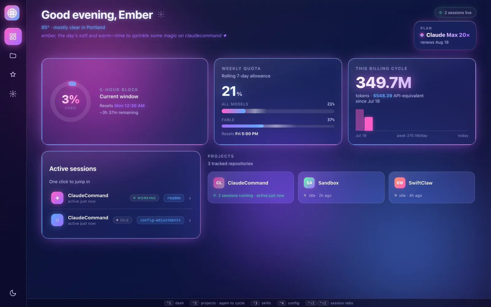
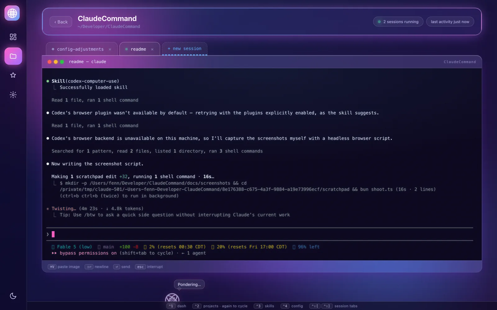
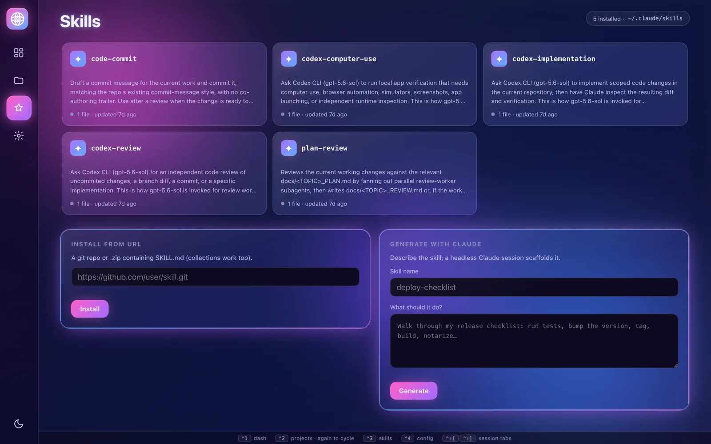
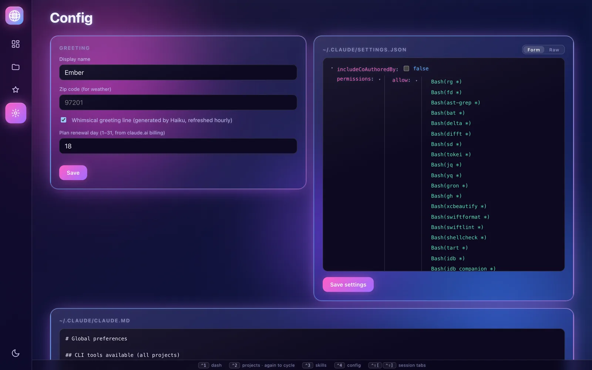
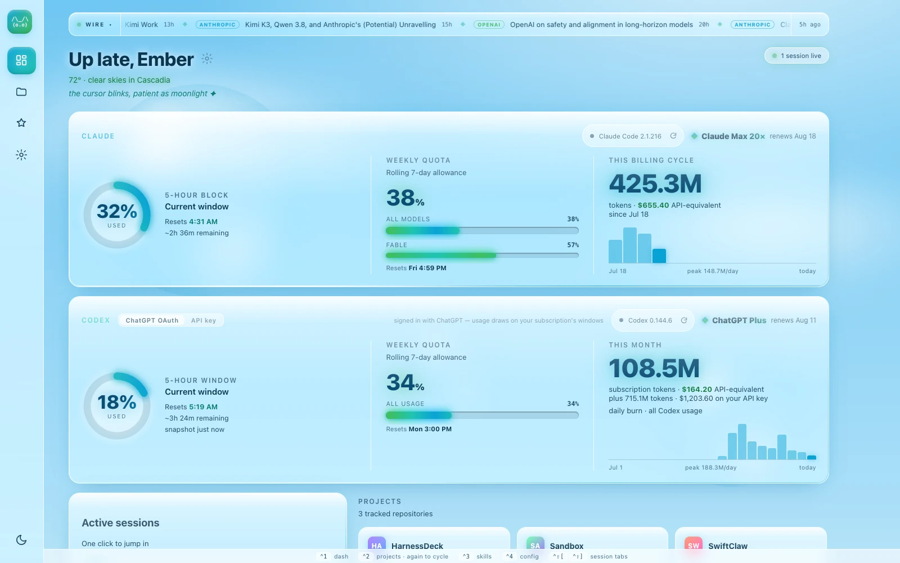

# HarnessDeck

A personal control center for your coding-agent harnesses — [Claude Code](https://claude.com/claude-code) and [Codex CLI](https://developers.openai.com/codex/cli/) — running as a small web app on your own Mac. It starts at login, lives at `http://localhost:4553`, and gives you one place to see everything your agents are doing across your projects — and to jump straight into any session from the browser.

(Formerly "Claude Command"; renamed when it grew beyond a single harness. See `docs/HARNESSES.md` for how harnesses are modeled and how to add another.)



## What it does

### Dashboard

The home screen greets you by name, with your local weather and a whimsical one-liner written fresh each hour by Claude itself. Below that:

- **Usage at a glance** — how much of your current 5-hour window and weekly allowance you've used, when each resets, and how many tokens you've burned this billing cycle (with the equivalent API price, so you can see what the subscription is saving you).
- **Codex card** — Codex gets its own usage strip, with a toggle between **API-key mode** (spend + tokens, billed pay-as-you-go) and **ChatGPT OAuth mode** (5-hour/weekly rate-limit windows, like Claude's). The toggle isn't just cosmetic: it rewrites `~/.codex/config.toml`, commenting or uncommenting the `model_provider` line so Codex actually switches auth.
- **Plan card** — your subscription tier and renewal date.
- **Active sessions** — every agent session currently running, with a live idle/working status and its harness. One click drops you into its terminal.
- **Projects** — every folder in `~/Developer`, with recent activity and running-session counts.

### Projects & terminals

Each project gets its own page with tabbed terminal sessions — one tab per agent session, so you can run several in parallel and flip between them. New sessions pick a harness (Claude or Codex) from a selector — or cycle it with **Shift+Tab** while typing the session name — and each tab shows which harness it runs.



Sessions run inside [tmux](https://github.com/tmux/tmux) behind the scenes, which means they survive server restarts, closed browser tabs, and even reboots of the app — reopen the page and your session is right where you left it. You can also **paste an image straight into the terminal**: it's saved to disk and the file path is typed into Claude's input for you, ready to submit.

### Skills

A visual manager for skills across harnesses (`~/.claude/skills` and `~/.codex/skills`). Browse what's installed with per-harness filtering and badges showing which harnesses own each skill, sync a skill to another harness with one click, and edit any skill's files right in the browser — edits to a shared skill land in every harness's copy, so they never drift. Install from a git or zip URL, or describe what you want and let a background Claude session write the skill for you.



### Config

Edit your global agent setup without hunting for dotfiles, cycling per harness: Claude's `settings.json` as a friendly collapsible tree (or raw JSON) and global `CLAUDE.md`, or Codex's `config.toml` (with an API-key/ChatGPT-OAuth switch) and `AGENTS.md` — plus the app's own preferences (display name, zip code for weather, greeting on/off, plan renewal day).



### Themes

Three looks, cycled from the sidebar: two dark neon/vaporwave themes (pink/blue and crimson) and **aero** — a light, Frutiger-Aero-inspired theme with sky gradients, drifting clouds, and soap bubbles. The terminal stays dark in every theme.



## How it's built

| Piece | Choice |
|-------|--------|
| Server | [Bun](https://bun.sh) — TypeScript with no build step, native WebSockets |
| Frontend | Svelte 5 + Vite single-page app |
| Terminal | xterm.js, bridged to tmux over a WebSocket |
| Sessions | tmux (`brew install tmux` required) |
| Usage data | Anthropic's OAuth usage endpoint + [ccusage](https://github.com/ryoppippi/ccusage) for monthly totals (`ccusage codex` for Codex; Codex OAuth limits read from `~/.codex/sessions` rollouts) |

## Running it

```bash
bun install
bun run build   # builds the web frontend
bun start       # serves on http://localhost:4553
```

For run-at-login, install a launchd LaunchAgent pointing at `bun server/index.ts` (this repo uses `com.fenn.claude-command` with `RunAtLoad` + `KeepAlive` — the label predates the HarnessDeck rename and is harmless to keep).

## A note on security

This app can start terminal sessions that run real commands, so it binds to **127.0.0.1 only** and has no authentication — it is meant for a single-user machine and must never be exposed to a network. (Optional Tailscale Serve support exists for reaching it from your own devices over your tailnet.)
